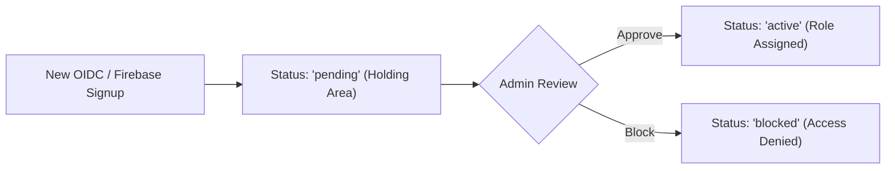

# NightRunner Roles, Permissions & User Assignments

The role plan agreed 2026-09-24 (#236). This document is the source of truth for
who can do what; the code mirrors it in two places, which must change together:

- **Frontend:** `nightrunner_frontend/src/lib/roles.js` (menus, route access, the
  User Manager's role picker and descriptions). Route access is menu-only: any
  signed-in user can still type a URL, so the backend is what actually stops them.
- **Backend:** `nightrunner_backend/models/user_roles.py` (`has_event_role`),
  called through `transport/permissions.py` on write endpoints.

The in-app **Help & Docs** page (`/help`, content in
`src/pages/help/helpContent.js`) explains the same matrix to volunteers.

---

## How roles are stored

- **System Admin** is a flag on the user (`users.is_admin`), not a role. It passes
  every check for every event.
- **Event roles** are stored one per user per event in `user_roles.role` as
  `"<event_id>:<role>"`. Clients see them as an `{eventId: role}` map
  (`roles_to_map`). Never test the stored strings with `in` — that bug is why event
  admins could not use several admin endpoints before #236.
- A role only counts while its event is selected.

## The roles

| Role | Key | What it is for |
|---|---|---|
| System Admin | `users.is_admin` | Full access to all functions of the program, across every event. |
| Event Admin | `event-admin` | Runs one event: stations, patrols, roster, users, gate, scoring, reports. |
| Scoring Team | `scoring-team` | Enters, reviews, reopens and corrects scores at the scoring center; Score Finalizer and reports. |
| Station Lead | `station-lead` | Checks patrols in and out at any station. Same as Station Volunteer for now; extra permissions planned. |
| Station Volunteer | `station-volunteer` | Checks patrols in and out at any station. No access to scoring. |
| Command Center | `command-center` | Tracks patrols on the night; creates and edits patrols. |
| Gate Check-In | `gate-checkin` | Gate Check-In and the Arrivals Dashboard. |
| Patrol Management | `patrol-management` | Creates and edits patrols. |
| Standard User | `user` | Signed in with no event role: lookups and Live Status. |

Renamed by migration `027_rename_event_roles.sql`: `event-ops` → `gate-checkin`,
`scoring-lead` and `scoring-center` → `scoring-team`, `scorer` and `volunteer` →
`station-volunteer`.

Scores are entered at the scoring center by specific adults on the Scoring Team,
not in the field.

---

## Permissions matrix

✅ = allowed · — = not allowed · **(server)** = also enforced by the backend

| Action | System Admin | Event Admin | Scoring Team | Station Lead / Volunteer | Command Center | Gate Check-In | Patrol Mgmt | Standard User |
|---|---|---|---|---|---|---|---|---|
| See events, stations, patrols (incl. phone and radio details) | ✅ | ✅ | ✅ | ✅ | ✅ | ✅ | ✅ | ✅ |
| Live Status | ✅ | ✅ | ✅ | ✅ | ✅ | ✅ | ✅ | ✅ |
| Check patrols in / out at any station **(server)** | ✅ | ✅ | ✅ | ✅ | — | — | — | — |
| Enter scores **(server)** | ✅ | ✅ | ✅ | — | — | — | — | — |
| Review Entries | ✅ | ✅ | ✅ | — | — | — | — | — |
| Reopen a finished station attempt **(server)** | ✅ | ✅ | ✅ | — | — | — | — | — |
| Correct a submitted entry (not built yet, §2.2) | ✅ | ✅ | ✅ | — | — | — | — | — |
| Command Center page (not built yet, §2.9/§2.12) | ✅ | ✅ | — | — | ✅ | — | — | — |
| Gate Check-In, Arrivals Dashboard | ✅ | ✅ | — | — | — | ✅ | — | — |
| Add someone at the gate who isn't on the roster **(server)** | ✅ | ✅ | — | — | — | — | — | — |
| Patrol Manager: create / edit / delete patrols **(server)** | ✅ | ✅ | — | — | ✅ | — | ✅ | — |
| Import Roster **(server)** | ✅ | ✅ | — | — | — | — | — | — |
| Event Manager, Station Manager, User Manager | ✅ | ✅ | — | — | — | — | — | — |
| Score Finalizer, Event Reports (finalized results **(server)**) | ✅ | ✅ | ✅ | — | — | — | — | — |
| Configuration Manager, grant System Admin | ✅ | — | — | — | — | — | — | — |

Not yet enforced on the server (frontend menus only): events, stations,
configurations, users, reports generation, arrivals. See #236.

---

## User Onboarding & Holding Area Flow



- When a new user logs in for the first time via OIDC / Firebase Auth, they are automatically provisioned with `status = "pending"` in the user holding area.
- Pending users cannot access event data until an Admin approves them and assigns them an event role.

---

## Local Development Identity Providers

NightRunner supports two local OIDC development modes:

### 1. Default Lightweight Mock OIDC (`oidc-server-mock`)
Fast, stateless OIDC server for quick local testing and automated CI.
```bash
docker compose up -d
```

### 2. Authentik Identity Provider Overlay
Full interactive OIDC provider with UI login, user management, and automated blueprint bootstrapping (`authentik/blueprints/nightrunner-dev.yaml`).
```bash
./scripts/start-dev-authentik.sh
```
Or directly via docker compose:
```bash
docker compose -f docker-compose.yaml -f docker-compose.authentik.yaml up -d --build
```
- **OIDC Authority**: `http://localhost:9000/application/o/nightrunner/`
- **Default Users & Password**: `adminuser`, `organizeruser`, `scoreruser`, `leaderuser` (Password: `password`)
- **Frontend Dev Mode**: Run `yarn --cwd nightrunner_frontend dev:authentik` to run Vite configured with Authentik OIDC authority (`.env.authentik`).

